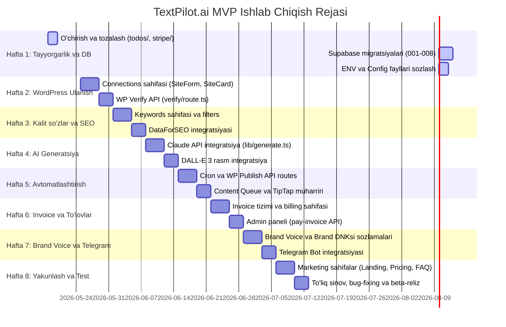

# TextPilot.ai | Developer Texnik Topshiriq (SaaS-Kit-Supabase -> TextPilot)

**Versiya 1.0** · **Amal qilish joyi:** `/Saas-Kit-supabase/`
*© 2025 TextPilot.ai | Ichki hujjat*

---

## 1. Loyiha Xaritasi: Nima bilan boshlaymiz
Saas-Kit-Supabase reposi bizning TextPilot loyihasi uchun tayyor skelet hisoblanadi. Quyida qaysi qismlar qolishi, o'zgarishi va yangi yozilishi ko'rsatilgan:

| Kategoriya | Tayyor foizi | Holati | Izoh |
| :--- | :---: | :---: | :--- |
| **Auth tizimi** (login, signup, forgot-password) | 95% | **QOLADI** | Faqat UI matnlari va logo o'zgaradi. |
| **Dashboard layout** (sidebar, header, nav) | 70% | **O'ZGARADI** | Navigatsiya TextPilot sahifalariga moslashtiriladi. |
| **Settings** (profile, billing, subscription) | 50% | **O'ZGARADI** | Stripe o'rniga Invoice & Credits tizimi qo'yiladi. |
| **Todos sahifasi** (barcha 11 fayl) | 100% | **O'CHIRILADI** | Bizning 4 ta yangi sahifamiz bilan almashtiriladi. |
| **Marketing** (landing, pricing, FAQ) | 60% | **O'ZGARADI** | TextPilot brendi va narxlari kiritiladi. |
| **Stripe servislar** (3 fayl) | 100% | **O'CHIRILADI** | Invoice + credits tizimi yoziladi. |
| **DB queries/mutations** (todos) | 100% | **O'CHIRILADI** | Sites, keywords, articles, invoices uchun yangidan yoziladi. |
| **Yangi sahifalar** (4 ta) | 0% | **YANGI** | Connections, Keywords, Content, Brand Voice sahifalari yaratiladi. |
| **Yangi API routes** (6 ta) | 0% | **YANGI** | Cron, Generate, WP, Telegram, Invoice, Admin, Keywords Fetch va Sites Verify routes. |
| **Yangi DB services** (4 ta) | 0% | **YANGI** | Sites, keywords, articles, invoices queries va mutations yoziladi. |

---

## 2. To'liq Fayl Xaritasi

### 2.1 Marketing Sahifalar (`(marketing)`)
| Fayl yo'li | Holat | Nima qilinadi |
| :--- | :---: | :--- |
| `(marketing)/page.tsx` | **O'ZGARADI** | Hero, Features qismlari TextPilot ma'lumotlari bilan to'ldiriladi. |
| `(marketing)/pricing/page.tsx` | **O'ZGARADI** | Starter ($29), Pro ($59), Agency ($99) narxlari kiritiladi. |
| `(marketing)/faq/page.tsx` | **O'ZGARADI** | TextPilot uchun maxsus savol-javoblar yoziladi (UZ/RU/EN tillari haqida). |
| `(marketing)/_PageSections/Hero.tsx` | **O'ZGARADI** | Sarlavha: `'WordPress saytingiz uchun AI SEO Autopilot'` qilib o'zgartiriladi. |
| `(marketing)/_PageSections/NavBar.tsx` | **O'ZGARADI** | Logo TextPilot-ga o'zgartiriladi va navigatsiya linklari moslashtiriladi. |
| `(marketing)/_PageSections/Feature.tsx` | **O'ZGARADI** | TextPilot-ning 4 ta asosiy imkoniyatlari (features) bilan to'ldiriladi. |
| `(marketing)/_PageSections/FeatureList.tsx` | **O'ZGARADI** | Feature ro'yxati TextPilot uchun yangilanadi. |
| `(marketing)/_PageSections/CTA.tsx` | **O'ZGARADI** | "Bepul boshlash" CTA tugmasi va matnlari o'zgartiriladi. |
| `(marketing)/_PageSections/Header.tsx` | **QOLADI** | Hech narsa o'zgarmaydi. |
| `(marketing)/_PageSections/LogoCloud.tsx` | **O'CHIRILADI** | Hozircha hamkorlarimiz yo'qligi sababli olib tashlanadi. |
| `(marketing)/layout.tsx` | **QOLADI** | Hech narsa o'zgarmaydi. |

### 2.2 Auth Sahifalar (`auth`)
| Fayl yo'li | Holat | Nima qilinadi |
| :--- | :---: | :--- |
| `auth/login/page.tsx` | **QOLADI** | Faqat logo va brend nomi TextPilot-ga o'zgaradi. |
| `auth/signup/page.tsx` | **QOLADI** | Faqat logo va brend nomi TextPilot-ga o'zgaradi. |
| `auth/forgot-password/page.tsx` | **QOLADI** | Hech narsa o'zgarmaydi. |
| `auth/magic-link/page.tsx` | **QOLADI** | Hech narsa o'zgarmaydi. |
| `auth/confirm/page.tsx` | **QOLADI** | Hech narsa o'zgarmaydi. |
| `auth/auth-required/page.tsx` | **QOLADI** | Hech narsa o'zgarmaydi. |
| `auth/error.tsx` | **QOLADI** | Hech narsa o'zgarmaydi. |
| `auth/layout.tsx` | **QOLADI** | Hech narsa o'zgarmaydi. |

### 2.3 Dashboard Asos Komponentlari
| Fayl yo'li | Holat | Nima qilinadi |
| :--- | :---: | :--- |
| `dashboard/layout.tsx` | **QOLADI** | Hech narsa o'zgarmaydi. |
| `dashboard/_PageSections/SideBar.tsx` | **O'ZGARADI** | TextPilot-ning 4 ta asosiy bo'lim navigatsiyasi qo'yiladi. |
| `dashboard/_PageSections/SidebarNav.tsx` | **O'ZGARADI** | Navigatsiya linklari: *Connections, Keywords, Content, Brand Voice*. |
| `dashboard/_PageSections/Header.tsx` | **O'ZGARADI** | Logo va "TextPilot" nomi yangilanadi. |
| `dashboard/_PageSections/UserNav.tsx` | **QOLADI** | Profile dropdown menyusi o'zgarishsiz qoladi. |
| `dashboard/_PageSections/TeamSwitcher.tsx` | **O'CHIRILADI** | Ko'p jamoali (multi-team) rejim kerak emas, olib tashlanadi. |
| `dashboard/_PageSections/DocShare.tsx` | **O'CHIRILADI** | Kerak bo'lmagan qism. |
| `dashboard/_PageSections/RecentSales.tsx` | **O'CHIRILADI** | Kerak bo'lmagan qism. |
| `dashboard/_PageSections/charts/Bar.tsx` | **QOLADI** | Kelajakda analytics uchun ishlatiladi. |
| `dashboard/_PageSections/charts/Compose.tsx` | **QOLADI** | Kelajakda analytics uchun ishlatiladi. |
| `dashboard/_PageSections/charts/Pie.tsx` | **QOLADI** | Kelajakda analytics uchun ishlatiladi. |
| `dashboard/error.tsx` | **QOLADI** | Hech narsa o'zgarmaydi. |

### 2.4 Dashboard Bosh Sahifa (`main`)
| Fayl yo'li | Holat | Nima qilinadi |
| :--- | :---: | :--- |
| `dashboard/main/page.tsx` | **O'ZGARADI** | TextPilot statistikasi: jami maqolalar, nashr qilinganlar, navbatdagi maqolalar ko'rsatiladi. |
| `dashboard/main/_PageSections/Dashboard.tsx` | **O'ZGARADI** | Stat kartalari: *Credits, Sites, Articles, Published*. |
| `dashboard/main/_PageSections/SummaryCard.tsx` | **QOLADI** | Karta komponenti o'zgarishsiz ishlatiladi. |

### 2.5 Settings Sahifalar
| Fayl yo'li | Holat | Nima qilinadi |
| :--- | :---: | :--- |
| `dashboard/settings/profile/page.tsx` | **QOLADI** | Profilni tahrirlash sahifasi o'zgarishsiz qoladi. |
| `dashboard/settings/billing/page.tsx` | **O'ZGARADI** | Stripe o'rniga **Invoice tizimi** ko'rsatiladi. |
| `dashboard/settings/subscription/page.tsx` | **O'ZGARADI** | Tanlangan plan (Starter/Pro/Agency) va qolgan credits (`credits_remaining`) ko'rsatiladi. |
| `dashboard/settings/add-subscription/page.tsx` | **O'ZGARADI** | PayPal yoki Invoice orqali to'lov tanlash sahifasiga o'zgaradi. |
| `dashboard/settings/subscription-required/page.tsx` | **QOLADI** | Credits (kreditlar) tugab qolganda ko'rsatiladigan ogohlantirish sahifasi. |
| `dashboard/settings/loading.tsx` | **QOLADI** | O'zgarishsiz qoladi. |
| `dashboard/settings/layout.tsx` | **QOLADI** | O'zgarishsiz qoladi. |
| `dashboard/settings/_PageSections/Billing.tsx` | **O'ZGARADI** | Invoice PDF formatini yuklab olish tugmasi qo'shiladi. |
| `dashboard/settings/_PageSections/Subscription.tsx` | **O'ZGARADI** | Kreditlar qoldig'ini ko'rsatuvchi progress bar (`credits_remaining`) qo'shiladi. |
| `dashboard/settings/_PageSections/SettingsNav.tsx` | **QOLADI** | O'zgarishsiz qoladi. |
| `dashboard/settings/_PageSections/SettingsHeader.tsx` | **QOLADI** | O'zgarishsiz qoladi. |
| `dashboard/settings/_PageSections/UpdateForms.tsx` | **QOLADI** | O'zgarishsiz qoladi. |
| `dashboard/settings/_PageSections/UpdateProfileCard.tsx` | **QOLADI** | O'zgarishsiz qoladi. |

### 2.6 Todos Sahifalar — TO'LIQ O'CHIRILADI
Quyidagi 11 ta fayldan iborat papka to'liq o'chirib tashlanadi va o'rniga bizning 4 ta yangi bo'limimiz yoziladi:
- `dashboard/todos/` (Papka to'liq o'chiriladi)
- `dashboard/todos/_PageSections/MyTodos.tsx`
- `dashboard/todos/_PageSections/TodosCreateForm.tsx`
- `dashboard/todos/_PageSections/TodosEditForm.tsx`
- `dashboard/todos/_PageSections/TodosHeader.tsx`
- `dashboard/todos/_PageSections/TodosList.tsx`
- `dashboard/todos/_PageSections/TodosNav.tsx`
- `dashboard/todos/create/page.tsx`
- `dashboard/todos/edit/[id]/page.tsx`
- `dashboard/todos/list-todos/page.tsx`
- `dashboard/todos/my-todos/page.tsx`

---

## 3. Yangi Dashboard Sahifalar — NOLDAN YOZILADI
Todos bo'limi o'rniga quyidagi 4 ta asosiy sahifa va ularning komponentlari noldan yaratiladi:

| Fayl yo'li | Holat | Nima qilinadi |
| :--- | :---: | :--- |
| **`dashboard/connections/page.tsx`** | **YANGI** | WordPress saytlarini ulash va boshqarish asosiy sahifasi. |
| `dashboard/connections/_PageSections/SiteForm.tsx` | **YANGI** | URL kiritish va WordPress Application Password formasi. |
| `dashboard/connections/_PageSections/SiteCard.tsx` | **YANGI** | Ulangan sayt kartasi (ulanish holati, jadvali va sozlamalari). |
| `dashboard/connections/_PageSections/SchedulePicker.tsx` | **YANGI** | Nashr qilish kunlari va vaqtlarini tanlash (checkbox + timepicker). |
| **`dashboard/keywords/page.tsx`** | **YANGI** | Kalit so'zlar (Keywords) paneli. |
| `dashboard/keywords/_PageSections/KeywordTable.tsx` | **YANGI** | Ro'yxat: Kalit so'z, qidiruv hajmi, raqobat darajasi va status enum. |
| `dashboard/keywords/_PageSections/KeywordForm.tsx` | **YANGI** | Qo'lda yoki fayldan yangi kalit so'zlarni qo'shish formasi. |
| `dashboard/keywords/_PageSections/KeywordFilters.tsx` | **YANGI** | UZ / RU / EN tillari va statuslar bo'yicha filtrlash. |
| **`dashboard/content/page.tsx`** | **YANGI** | Kontent navbati va muharrir sahifasi. |
| `dashboard/content/_PageSections/ContentQueue.tsx` | **YANGI** | Oylik kontent rejalari va maqolalar navbati ro'yxati (statuslar bilan). |
| `dashboard/content/_PageSections/ArticleEditor.tsx` | **YANGI** | TipTap HTML asosidagi maqolalarni tahrirlash muharriri. |
| `dashboard/content/_PageSections/ArticleCard.tsx` | **YANGI** | Maqola kartasi: Sarlavha, rejalashtirilgan sana, holat va tezkor boshqaruv tugmalari. |
| **`dashboard/brand-voice/page.tsx`** | **YANGI** | Brend ovozi (Brand Voice) va DNKsi sozlamalari sahifasi. |
| `dashboard/brand-voice/_PageSections/BrandForm.tsx` | **YANGI** | Biznes tavsifi, maqsadli auditoriya, ohang (tone of voice) va yozish tili. |
| `dashboard/brand-voice/_PageSections/SiteScanner.tsx` | **YANGI** | Sayt URL manzilini kiritib, brend ovozini avtomatik tahlil qilib aniqlash. |
| `dashboard/brand-voice/_PageSections/Analytics.tsx` | **YANGI** | Oxirgi 30 kunlik nashrlar statistikasi va grafik diagrammasi. |

---

## 4. API Routes

### 4.1 Mavjud API Routes holati
| Fayl yo'li | Holat | Nima qilinadi |
| :--- | :---: | :--- |
| `api/auth-callback/route.ts` | **QOLADI** | Supabase auth redirect logic - o'zgarishsiz qoladi. |
| `api/stripe/webhook/route.ts` | **O'CHIRILADI** | Stripe webhook o'chirilib, yangi invoice webhook/admin routes yoziladi. |

### 4.2 Yangi API Routes — NOLDAN YOZILADI
| Fayl yo'li | Holat | Nima qilinadi |
| :--- | :---: | :--- |
| `api/cron/route.ts` | **YANGI** | Supabase cron trigger: Har kuni rejalashtirilgan maqolalarni generatsiya qilishni boshlaydi. |
| `api/generate/route.ts` | **YANGI** | Claude 3.5 Sonnet API + DALL-E 3 pipeline: to'liq maqola va muqova rasmini yaratadi. |
| `api/wordpress/publish/route.ts` | **YANGI** | WordPress REST API integratsiyasi: tayyor maqolalarni avtomatik saytga yuklaydi. |
| `api/telegram/notify/route.ts` | **YANGI** | Telegram Bot API: yangi maqola muvaffaqiyatli nashr etilganda kanalda post e'lon qiladi. |
| `api/invoice/generate/route.ts` | **YANGI** | pdfkit yordamida to'lov hisobvaraqlarini (PDF invoice) yaratadi va Supabase Storage-ga joylaydi. |
| `api/admin/pay-invoice/route.ts` | **YANGI** | Admin controller: Invoice holatini "paid" ga o'zgartiradi va foydalanuvchiga credits qo'shadi. |
| `api/keywords/fetch/route.ts` | **YANGI** | DataForSEO API-dan kalit so'zlarni, ularning qidiruv hajmi va qiyinchilik darajasini oladi. |
| `api/sites/verify/route.ts` | **YANGI** | WordPress saytiga ulanish va yozish huquqlarini sinov tariqasida tekshiradi (test post). |

---

## 5. Lib Qatlamlari — Database va Servislar

### 5.1 Mavjud lib/API — O'chiriladigan va O'zgaradiganlar
| Fayl yo'li | Holat | Nima qilinadi |
| :--- | :---: | :--- |
| `lib/API/Database/todos/mutations.ts` | **O'CHIRILADI** | Todos CRUD mutations - butunlay keraksiz. |
| `lib/API/Database/todos/queries.ts` | **O'CHIRILADI** | Todos queries - butunlay keraksiz. |
| `lib/API/Database/subcription/queries.ts` | **O'ZGARADI** | Profilga `credits_remaining` va yangi plan enumlari qo'shiladi. |
| `lib/API/Database/profile/mutations.ts` | **QOLADI** | Profilni tahrirlash mutations o'zgarishsiz qoladi. |
| `lib/API/Database/profile/queries.ts` | **QOLADI** | Profil queries o'zgarishsiz qoladi. |
| `lib/API/Services/init/stripe.ts` | **O'CHIRILADI** | Stripe SDK initialization olib tashlanadi. |
| `lib/API/Services/init/supabase.ts` | **QOLADI** | Supabase asosiy client kutubxonasi saqlanib qoladi. |
| `lib/API/Services/stripe/customer.ts` | **O'CHIRILADI** | Stripe customer creation o'chiriladi. |
| `lib/API/Services/stripe/session.ts` | **O'CHIRILADI** | Stripe checkout session o'chiriladi. |
| `lib/API/Services/stripe/webhook.ts` | **O'CHIRILADI** | Stripe webhook handle logic o'chiriladi. |
| `lib/API/Services/supabase/auth.ts` | **QOLADI** | Supabase auth helper funksiyalari o'zgarishsiz qoladi. |
| `lib/API/Services/supabase/user.ts` | **QOLADI** | User context helper funksiyalari o'zgarishsiz qoladi. |

### 5.2 Yangi Database Queries/Mutations — NOLDAN YOZILADI
- **`lib/API/Database/sites/queries.ts`** va **`mutations.ts`**
  - `getSitesByUser`, `getSiteById`, `getSiteWithBrandVoice`
  - `createSite`, `updateSite`, `deleteSite`, `updateSchedule`
- **`lib/API/Database/keywords/queries.ts`** va **`mutations.ts`**
  - `getKeywordsBySite`, `getPendingKeywords`, `getApprovedKeywords`
  - `createKeyword`, `approveKeyword`, `updateKeywordStatus`
- **`lib/API/Database/articles/queries.ts`** va **`mutations.ts`**
  - `getArticlesBySite`, `getArticleById`, `getDraftArticles`
  - `createArticle`, `updateArticle`, `markPublished`, `setError`
- **`lib/API/Database/invoices/queries.ts`** va **`mutations.ts`**
  - `getInvoicesByUser`, `getPendingInvoices`
  - `createInvoice`, `markInvoicePaid` (to'langandan keyin foydalanuvchiga kerakli miqdorda credits qo'shadi)

### 5.3 Yangi Servislar — NOLDAN YOZILADI
- **`lib/API/Services/claude/generate.ts`**: Claude 3.5 Sonnet API orqali SEO optimallashgan to'liq maqolani yozish funksiyasi.
- **`lib/API/Services/image/generate.ts`**: OpenAI DALL-E 3 API orqali maqola sarlavhasiga mos vizual rasm yaratish.
- **`lib/API/Services/wordpress/publish.ts`**: WordPress REST API orqali media yuklash va postni 'publish' qilish.
- **`lib/API/Services/wordpress/verify.ts`**: WordPress-ga ulanishni va parollarning to'g'riligini tekshirish xizmati.
- **`lib/API/Services/telegram/notify.ts`**: Telegram Bot API orqali kanal yoki guruhga chiroyli formatda post yuborish.
- **`lib/API/Services/invoice/pdf.ts`**: `pdfkit` kutubxonasi yordamida to'lov hisob-kitoblarining PDF hujjatlarini generatsiya qilish.
- **`lib/API/Services/keywords/fetch.ts`**: DataForSEO API so'rovlarini boshqarish va kalit so'zlarni tahlil qilish.
- **`lib/API/Services/init/anthropic.ts`**: Anthropic SDK client init qilish.

---

## 6. Types va Config Fayllar

| Fayl yo'li | Holat | Nima qilinadi |
| :--- | :---: | :--- |
| `lib/types/stripe.ts` | **O'CHIRILADI** | Stripe typelari olib tashlanadi. |
| `lib/types/todos.ts` | **O'CHIRILADI** | Todos typelari olib tashlanadi. |
| `lib/types/enums.ts` | **O'ZGARADI** | Yangi plan enumi qo'shiladi: `FREE \| STARTER \| PRO \| AGENCY`. |
| `lib/types/types.ts` | **O'ZGARADI** | `Site`, `Keyword`, `Article`, `Invoice`, `BrandVoice` interfeyslari qo'shiladi. |
| `lib/types/validations.ts` | **O'ZGARADI** | Zod validation sxemalari: `siteSchema`, `keywordSchema`, `invoiceSchema` kiritiladi. |
| `lib/types/supabase.ts` | **O'ZGARADI** | Supabase CLI orqali jadvallar uchun typescript turlari qayta generatsiya qilinadi. |
| `lib/config/site.ts` | **O'ZGARADI** | Loyiha nomi "TextPilot.ai" ga, description va URL manziliga o'zgaradi. |
| `lib/config/dashboard.ts` | **O'ZGARADI** | Sidebar navigatsiya havolalari (links) TextPilot sahifalariga moslab yangilanadi. |
| `lib/config/marketing.ts` | **O'ZGARADI** | Landing page matnlari va pricing ta'riflari TextPilot brendi uchun yoziladi. |
| `lib/config/api.ts` | **O'ZGARADI** | Yangi API endpointlarining URL manzillari qo'shiladi. |
| `lib/config/auth.ts` | **QOLADI** | O'zgarishsiz qoladi. |
| `lib/utils/error.ts` | **QOLADI** | O'zgarishsiz qoladi. |
| `lib/utils/helpers.ts` | **O'ZGARADI** | `formatCredits`, `formatDate`, `calculateNextPublish` yordamchi funksiyalari qo'shiladi. |
| `lib/utils/hooks.ts` | **O'ZGARADI** | `useSite`, `useKeywords`, `useArticles` custom react hooklari yoziladi. |

---

## 7. Supabase Database Migratsiyalari
Supabase-da yangi migratsiya fayllari yaratiladi: `npx supabase migration new [nom]`

- **`supabase/migrations/001_sites.sql`**
  `sites` jadvali: `id`, `user_id`, `url`, `wp_password` (Supabase Vault orqali shifrlanadi), `brand_voice` (jsonb), `publish_days` (kunlar ro'yxati), `publish_time`, `is_active`, `telegram_chat_id`.
- **`supabase/migrations/002_keywords.sql`**
  `keywords` jadvali: `id`, `site_id`, `keyword`, `language` (uz/ru/en), `search_volume` (int), `difficulty` (int), `status` (pending/approved/rejected/completed), `approved_by_user` (boolean), `article_id`.
- **`supabase/migrations/003_articles.sql`**
  `articles` jadvali: `id`, `site_id`, `keyword_id`, `title`, `content` (text), `featured_image_url`, `wp_post_id` (int), `status` (draft/scheduled/published/error), `scheduled_for` (timestamp), `published_at` (timestamp), `ai_tokens_used` (int).
- **`supabase/migrations/004_invoices.sql`**
  `invoices` jadvali: `id`, `user_id`, `amount_usd`, `credits_to_add` (int), `status` (pending/paid/cancelled), `invoice_pdf_url`, `paid_at`.
- **`supabase/migrations/005_credits.sql`**
  `profiles` jadvaliga `credits_remaining` (int, default 0) va `plan` (enum: FREE, STARTER, PRO, AGENCY) ustunlari qo'shiladi.
- **`supabase/migrations/006_rls.sql`**
  Barcha jadvallar uchun Row Level Security (RLS) siyosatlari: Har bir foydalanuvchi faqat o'ziga tegishli bo'lgan ma'lumotlarni ko'ra oladi va tahrirlay oladi (`user_id = auth.uid()`).
- **`supabase/migrations/007_cron.sql`**
  Supabase `pg_cron` moduli orqali har kuni 03:00 UTC vaqtida `publish_articles()` database funksiyasini chaqirish o'rnatiladi.
- **`supabase/migrations/008_functions.sql`**
  Avtomatik maqola chiqarish uchun `publish_articles()` nomli SQL plpgsql funksiyasi yoziladi (cron tomonidan trigger qilinadi).
- **`supabase/types.ts`**
  Jadvallar o'zgargandan so'ng, `npx supabase gen types typescript --local > src/lib/types/supabase.ts` orqali turlar yangilanadi.

---

## 8. Muhit O'zgaruvchilari (`.env.local`)
`.env.example` fayliga quyidagi yangi o'zgaruvchilar qo'shiladi va `.env.local` da qiymatlar to'ldiriladi:

```bash
# SUPABASE SOZLAMALARI (Mavjud)
NEXT_PUBLIC_SUPABASE_URL=https://your-project.supabase.co
NEXT_PUBLIC_SUPABASE_ANON_KEY=eyJhbGciOi...
SUPABASE_SERVICE_ROLE_KEY=eyJhbGciOi...

# SUN'IY INTELLEKT API KALITLARI (YANGI)
ANTHROPIC_API_KEY=sk-ant-api03-... # Claude 3.5 Sonnet uchun
OPENAI_API_KEY=sk-proj-...         # DALL-E 3 muqova rasmlari uchun

# SEO VA QIDIRUV API (YANGI)
DATAFORSEO_LOGIN=your_dataforseo_login
DATAFORSEO_PASSWORD=your_dataforseo_password

# TELEGRAM BOT INTEGRATSIYA (YANGI)
TELEGRAM_BOT_TOKEN=1234567890:AAH...

# XAVFSIZLIK VA CRON TIZIMI (YANGI)
CRON_SECRET=super_secret_cron_token_123
SUPABASE_VAULT_KEY=your_vault_encryption_key_for_wp_passwords
```

---

## 9. Komponentlar va UI

- **`components/MainLogo.tsx`**: TextPilot.ai logotipi, animatsiyali AI ramzi va brend nomi joylashtiriladi.
- **`components/Footer.tsx`**: TextPilot kompaniya manzili, email manzili, ijtimoiy tarmoqlar va foydalanish shartlari.
- **`components/Form.tsx`**: Tizimdagi formalar uchun tayyor o'zgarishsiz qoladigan komponentlar.
- **`components/Icons.tsx`**: WordPress, Telegram, Claude, OpenAI va boshqa tizimli ikonalarni qo'shish.
- **`components/MobileNav.tsx`**: Mobil menyuga yangi bo'limlar navigatsiyasini integratsiya qilish.
- **`components/ThemeDropdown.tsx`**: Dark va Light modeni almashtirish tugmasi (o'zgarishsiz qoladi).
- **`components/ErrorText.tsx`**: Xatoliklarni chiroyli ko'rsatish uchun.
- **`components/ui/`**: Mavjud barcha 12 ta shadcn UI komponentlari o'zgarishsiz qoladi.
- **`components/ui/TipTapEditor.tsx` (YANGI)**: Rich text HTML muharriri, maqolalarni nashrdan oldin tahrirlash uchun.
- **`components/ui/CreditsBadge.tsx` (YANGI)**: Balansdagi qolgan kreditlar miqdorini chiroyli ko'rsatuvchi badge.
- **`components/ui/StatusBadge.tsx` (YANGI)**: Maqola holatlari (draft / scheduled / published / error) uchun rangli badgellar.
- **`components/ui/LanguageSwitcher.tsx` (YANGI)**: Kontent va kalit so'zlar uchun UZ / RU / EN til tanlash komponenti.

---

## 10. Package.json — Qo'shiladigan Paketlar

Quyidagi yangi paketlar `npm install` orqali loyihaga qo'shiladi:

```json
{
  "dependencies": {
    "@anthropic-ai/sdk": "latest",
    "openai": "latest",
    "pdfkit": "^0.15.0",
    "@tiptap/react": "^2.4.0",
    "@tiptap/starter-kit": "^2.4.0",
    "node-telegram-bot-api": "^0.66.0",
    "node-cron": "^3.0.0"
  }
}
```

### O'chiriladigan paketlar (Stripe olib tashlanadi):
- `stripe` (Invoice tizimi bilan almashtirildi)
- `@stripe/stripe-js`

---

## 11. Ishlab Chiqish Tartibi (Haftalik reja)



---

## 12. Telegram Integratsiya — Batafsil
O'zbekistonda 27 milliondan ortiq Telegram foydalanuvchisi mavjudligini hisobga olib, ushbu integratsiya TextPilot platformasining eng muhim marketing kanali hisoblanadi.

### 12.1 Qanday ishlaydi?
1. Foydalanuvchi **Brand Voice** sahifasida o'zining Telegram kanali yoki guruhi ID-sini kiritadi (`-100XXXXXXXXX`).
2. Yangi maqola WordPress saytida nashr qilingandan so'ng, tizim avtomatik ravishda Telegram bot orqali kanalga post yuboradi.
3. Post tarkibida: **Maqola sarlavhasi** + **qisqa anons (1-2 jumla)** + **sayt havolasi (link)** + **AI tomonidan yaratilgan rasm** bo'ladi.
4. Bu xizmat mutlaqo bepul — Telegram Bot API cheklovlari (kuniga 30 ta postgacha bo'lgan limit) loyihamiz uchun juda katta imkoniyat beradi.

### 12.2 Texnik Amalga Oshirish
- **`lib/API/Services/telegram/notify.ts` (YANGI)**: `sendTelegramPost` helper funksiyasi yoziladi.
- **`api/telegram/notify/route.ts` (YANGI)**: Maqola WordPress-da nashr qilingandan so'ng chaqiriladigan POST API route.
- **`dashboard/brand-voice/_PageSections/BrandForm.tsx`**: Sozlamalarga `telegram_chat_id` input maydoni qo'shiladi.
- **`supabase/migrations/001_sites.sql`**: `sites` jadvalida `telegram_chat_id` ustuni ochiladi.

```typescript
// lib/API/Services/telegram/notify.ts
import TelegramBot from 'node-telegram-bot-api';

interface TelegramPostOptions {
  chatId: string;      // Kanal yoki guruh ID si (-100XXXXXXXXX)
  title: string;       // Maqola sarlavhasi
  excerpt: string;     // 1-2 jumla anons matni
  url: string;         // WordPress maqola havolasi
  imageUrl?: string;   // Sun'iy intellekt tomonidan yaratilgan rasm (ixtiyoriy)
}

export async function sendTelegramPost({
  chatId,
  title,
  excerpt,
  url,
  imageUrl
}: TelegramPostOptions) {
  const botToken = process.env.TELEGRAM_BOT_TOKEN;
  if (!botToken) throw new Error("TELEGRAM_BOT_TOKEN topilmadi!");

  const bot = new TelegramBot(botToken, { polling: false });
  const messageText = `<b>${title}</b>\n\n${excerpt}\n\n🔗 <a href="${url}">Batafsil o'qish</a>`;

  if (imageUrl) {
    await bot.sendPhoto(chatId, imageUrl, {
      caption: messageText,
      parse_mode: 'HTML'
    });
  } else {
    await bot.sendMessage(chatId, messageText, {
      parse_mode: 'HTML',
      disable_web_page_preview: false
    });
  }
}
```

### 12.3 Telegram Botni Sozlash Qadamlari (Faqat 1 marta bajariladi)
1. Telegram-da `@BotFather` botiga yozing va `/newbot` buyrug'i orqali yangi bot yaratib, uning **API Token** kalitini oling.
2. Ushbu token kalitini loyihadagi `.env.local` fayliga joylang: `TELEGRAM_BOT_TOKEN=xxx`.
3. Botni o'z kanalingiz yoki guruhingizga qo'shib, unga **Admin (Administrator)** huquqlarini bering.
4. Kanal ID-sini bilish uchun kanaldan biron bir xabarni `@userinfobot`-ga forwarding qiling va kanalning maxsus ID raqamini oling (masalan: `-1001234567890`).
5. Olingan kanal ID raqamini **Brand Voice** sozlamalarida saqlang.

---

## 13. Xulosa va Birinchi Qadamlar

### Birinchi kun amalga oshiriladigan ishlar:
1. Terminalda quyidagi buyruqlarni berish:
   ```bash
   sudo chown -R 501:20 ~/.npm
   npm install
   npm run dev
   ```
2. Keraksiz `dashboard/todos/` bo'limi va papkasini to'liq o'chirish.
3. Stripe xizmatlari bilan bog'liq bo'lgan `lib/API/Services/stripe/` papkasini o'chirish.
4. Loyiha ildizida `.env.local` faylini yaratish va sun'iy intellekt API kalitlarini joylash.
5. Supabase migrations papkasida `001-008` migratsiyalarini tayyorlash va bazaga yuklash.

### Birinchi hafta yakuni:
- WordPress-ga ulanish (Connections) sahifasi va ulanishni tekshirish xizmati to'liq ishlashi ta'minlanadi!
